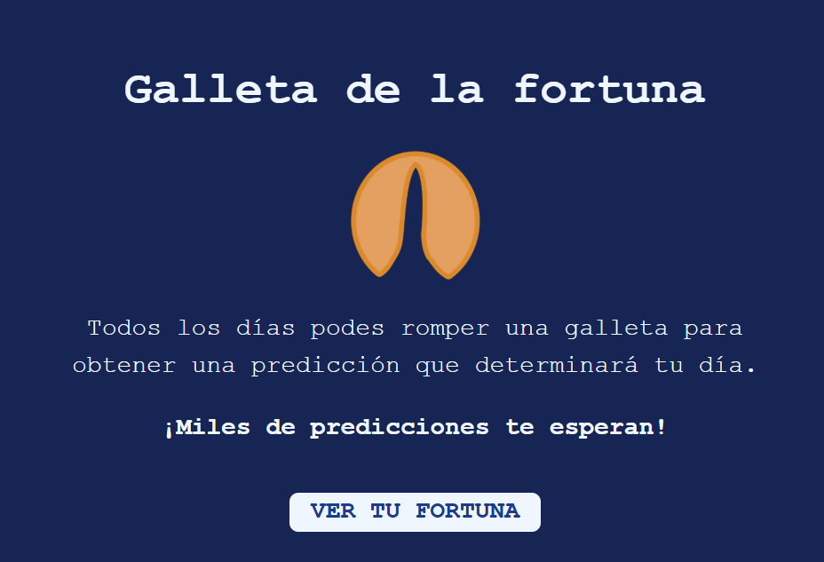

# CookieFortune 🥠

Esta app permite mostrar un mensaje aleatorio de la fortuna junto con un número de la suerte.  
Los mensajes son obtenidos desde Master Data de la entidad `CF` (Cookie Fortunes).

El componente muestra un botón que al hacer clic, despliega un modal con la fortuna y el número generado.

---

## Screenshots 📸



---

## Setup 🔧

Declarar el bloque `"cookie-fortune"` en la sección del sitio que se necesite.

---

### Agregarlo al store theme

En el `manifest.json` declarar la dependencia:

```json
  {
    "dependencies": {
      "valtech.cookie-fortune": "0.x"
    }
  }
```
    
## Ejemplo 🧤

```json
  {
    "flex-layout.row#container": {
      "children": [
        "cookie-fortune"
      ],
    }
  }
```

## Features 💫

- Consulta frases de la fortuna en Master Data.
- Genera un número de la suerte.

---

## CSS Customization :art:

|Handle                        | Description                     |
|------------------------------| --------------------------------|
|CookieFortuneContainer        | Contenedor principal            |    
|CookieFortune	               | Contenedor del mensaje y número |  
|CookieFortuneMessageContainer | Contenedor modal                | 
|CookieFortuneMessage          | Texto                           | 
|CookieFortuneLuckyNumber      | Número                          | 
|CookieImage                   | Imagen                          | 